# Expenses Tracker API

A Spring Boot REST API for managing personal finances per registered user. It handles user registration and login with JWT-based session authentication, protects all financial endpoints by requester identity, and exposes CRUD operations for accounts, categories, and movements (income / expenses).

## Table of contents

- [Features](#features)
- [Tech stack](#tech-stack)
- [Architecture](#architecture)
- [Project structure](#project-structure)
- [Getting started](#getting-started)
- [Configuration](#configuration)
- [API reference](#api-reference)
- [Security](#security)
- [Persistence](#persistence)
- [Error handling](#error-handling)
- [Build and tests](#build-and-tests)
- [License](#license)
- [Author](#author)

## Features

- User registration (`POST /auth/signup`) and login (`POST /auth/login`) with JWT issuance.
- Stateless request authentication via a custom JWT filter.
- Per-user financial data isolation: movements, accounts, and categories are always resolved from the authenticated session username.
- Account management: list own accounts, list available currencies, create and delete accounts.
- Category management: list available categories, create and delete categories.
- Movement management: filtered retrieval of user movements, movement filter metadata (types / dates), create, update, and delete movements.
- Centralized error handling with a `@ControllerAdvice` boundary.
- DTO-based request/response contracts plus MapStruct mappers for entity conversion.
- H2 in-memory database for development/testing, seeded via `sql/*.sql`.
- WAR packaging with `ServletInitializer` for external servlet-container deployment.

## Tech stack

- Java 17
- Spring Boot 3.5.6 (`spring-boot-starter-web`, `spring-boot-starter-security`, `spring-boot-starter-data-jpa`, `spring-boot-starter-data-jdbc`)
- Spring Security with stateless session management
- JWT: `io.jsonwebtoken` (`jjwt-api`, `jjwt-impl`, `jjwt-jackson`, version `0.11.5`)
- JPA / Hibernate with H2 (`com.h2database:h2`, runtime scope)
- MapStruct `1.6.3` (+ `mapstruct-processor`) with Lombok and `spring-boot-configuration-processor`
- Maven wrapper (`mvnw` / `mvnw.cmd`), packaging: `war`

## Architecture

```mermaid
flowchart TD
subgraph group_runtime["Runtime"]
  node_app{{"Spring Boot application<br/>application entry"}}
  node_servlet["Servlet initializer<br/>deployment adapter"]
  node_settings["Application settings<br/>runtime configuration"]
end

subgraph group_api["HTTP API"]
  node_auth_controller["Authentication controller<br/>REST controller"]
  node_financial_controllers["Financial controllers<br/>REST controllers"]
  node_dtos["API DTOs<br/>request/response contracts"]
  node_error_advice["Controller advice<br/>error boundary"]
end

subgraph group_security["Security"]
  node_security_config["Security config<br/>access rules"]
  node_jwt_filter["JWT authentication filter<br/>request filter"]
  node_auth_service["Authentication service<br/>application service"]
  node_jwt_service["JWT service<br/>token service<br/>[JwtService.java]"]
end

subgraph group_domain["Domain"]
  node_financial_services["Financial services<br/>application services"]
  node_mappers["DTO mappers<br/>mapping layer"]
  node_movement_type["Movement type<br/>domain enum<br/>[MovementType.java]"]
end

subgraph group_persistence["Persistence"]
  node_entities["User financial entities<br/>JPA entities"]
  node_repositories["Entity repositories<br/>JPA repositories"]
  node_user_sql["User SQL script<br/>database script<br/>[user.sql]"]
  node_database[("Database<br/>external infrastructure")]
end

node_app -->|"boots"| node_security_config
node_servlet -.->|"deploys"| node_app
node_settings -.->|"configures connection"| node_database
node_security_config -->|"installs"| node_jwt_filter
node_jwt_filter -->|"validates token"| node_jwt_service
node_jwt_filter -->|"authorizes requests"| node_financial_controllers
node_auth_controller -->|"login requests"| node_auth_service
node_auth_service -->|"issues sessions"| node_jwt_service
node_auth_controller -->|"uses"| node_dtos
node_financial_controllers -->|"uses"| node_dtos
node_financial_controllers -->|"delegates"| node_financial_services
node_financial_services -->|"maps DTOs"| node_mappers
node_financial_services -->|"applies"| node_movement_type
node_financial_services -->|"persists through"| node_repositories
node_repositories -->|"manages"| node_entities
node_repositories -->|"reads and writes"| node_database
node_user_sql -.->|"initializes users"| node_database
node_financial_services -.->|"domain exceptions"| node_error_advice

click node_app "https://github.com/neflodev/expensestrackerapi/blob/master/src/main/java/com/neflodev/expensestrackerapi/ExpensesTrackerApiApplication.java"
click node_servlet "https://github.com/neflodev/expensestrackerapi/blob/master/src/main/java/com/neflodev/expensestrackerapi/ServletInitializer.java"
click node_settings "https://github.com/neflodev/expensestrackerapi/blob/master/src/main/resources/application.properties"
click node_auth_controller "https://github.com/neflodev/expensestrackerapi/blob/master/src/main/java/com/neflodev/expensestrackerapi/web/AuthenticationController.java"
click node_financial_controllers "https://github.com/neflodev/expensestrackerapi/blob/master/src/main/java/com/neflodev/expensestrackerapi/web/MovementController.java"
click node_dtos "https://github.com/neflodev/expensestrackerapi/blob/master/src/main/java/com/neflodev/expensestrackerapi/dto/movement/MovementRequestBody.java"
click node_error_advice "https://github.com/neflodev/expensestrackerapi/blob/master/src/main/java/com/neflodev/expensestrackerapi/exception/CustomControllerAdvice.java"
click node_security_config "https://github.com/neflodev/expensestrackerapi/blob/master/src/main/java/com/neflodev/expensestrackerapi/config/SecurityConfig.java"
click node_jwt_filter "https://github.com/neflodev/expensestrackerapi/blob/master/src/main/java/com/neflodev/expensestrackerapi/config/JwtAuthenticationFilter.java"
click node_auth_service "https://github.com/neflodev/expensestrackerapi/blob/master/src/main/java/com/neflodev/expensestrackerapi/service/authentication/AuthenticationService.java"
click node_jwt_service "https://github.com/neflodev/expensestrackerapi/blob/master/src/main/java/com/neflodev/expensestrackerapi/service/authentication/JwtService.java"
click node_financial_services "https://github.com/neflodev/expensestrackerapi/blob/master/src/main/java/com/neflodev/expensestrackerapi/service/MovementService.java"
click node_mappers "https://github.com/neflodev/expensestrackerapi/blob/master/src/main/java/com/neflodev/expensestrackerapi/mapper/MovementMapper.java"
click node_movement_type "https://github.com/neflodev/expensestrackerapi/blob/master/src/main/java/com/neflodev/expensestrackerapi/constants/enums/MovementType.java"
click node_entities "https://github.com/neflodev/expensestrackerapi/blob/master/src/main/java/com/neflodev/expensestrackerapi/model/MovementEntity.java"
click node_repositories "https://github.com/neflodev/expensestrackerapi/blob/master/src/main/java/com/neflodev/expensestrackerapi/repository/MovementEntityRepository.java"
click node_user_sql "https://github.com/neflodev/expensestrackerapi/blob/master/src/main/resources/sql/user.sql"

classDef toneNeutral fill:#f8fafc,stroke:#334155,stroke-width:1.5px,color:#0f172a
classDef toneBlue fill:#dbeafe,stroke:#2563eb,stroke-width:1.5px,color:#172554
classDef toneAmber fill:#fef3c7,stroke:#d97706,stroke-width:1.5px,color:#78350f
classDef toneMint fill:#dcfce7,stroke:#16a34a,stroke-width:1.5px,color:#14532d
classDef toneRose fill:#ffe4e6,stroke:#e11d48,stroke-width:1.5px,color:#881337
classDef toneIndigo fill:#e0e7ff,stroke:#4f46e5,stroke-width:1.5px,color:#312e81
classDef toneTeal fill:#ccfbf1,stroke:#0f766e,stroke-width:1.5px,color:#134e4a
class node_app,node_servlet,node_settings toneBlue
class node_auth_controller,node_financial_controllers,node_dtos,node_error_advice toneAmber
class node_security_config,node_jwt_filter,node_auth_service,node_jwt_service toneMint
class node_financial_services,node_mappers,node_movement_type toneRose
class node_entities,node_repositories,node_user_sql,node_database toneIndigo
```



> GitHub renders the `click` directives above as links from diagram nodes to their source files.

Request flow:

1. `ExpensesTrackerApiApplication` boots the application; `ServletInitializer` adapts it for WAR deployment.
2. `SecurityConfig` installs `JwtAuthenticationFilter` before `UsernamePasswordAuthenticationFilter`.
3. Public `POST /auth/signup` and `POST /auth/login` go through `AuthenticationController` -> `AuthenticationService` -> `JwtService`.
4. All other requests must carry `Authorization: Bearer <jwt>`; the filter validates the token with `JwtService` and establishes the security context.
5. Financial controllers (`AccountController`, `CategoryController`, `MovementController`) resolve the session username via `CustomUtils.retrieveSessionUsername()` and delegate to `AccountService`, `CategoryService`, and `MovementService`.
6. Services apply domain rules (including `MovementType`), convert DTOs with MapStruct mappers, and persist through Spring Data JPA repositories/entities to the database.
7. Domain exceptions are translated by `CustomControllerAdvice` into structured error responses.

## Project structure

```text
src/main/java/com/neflodev/expensestrackerapi/
├── ExpensesTrackerApiApplication.java   # Spring Boot entry point
├── ServletInitializer.java             # WAR / servlet-container adapter
├── config/
│   ├── SecurityConfig.java             # Access rules, stateless sessions, JWT filter wiring, CORS
│   ├── JwtAuthenticationFilter.java    # Per-request JWT validation
│   └── ExpensesTrackerAPIConfig.java   # Application beans (auth provider, etc.)
├── web/
│   ├── AuthenticationController.java   # POST /auth/signup, POST /auth/login
│   ├── AccountController.java          # /accounts/...
│   ├── CategoryController.java         # /categories/...
│   └── MovementController.java         # /movements/...
├── dto/
│   ├── authentication/                 # RegisterUserDTO, LoginUserDTO, LoginResponse
│   ├── account/                        # AccountCreateParams, AccountDto
│   ├── category/                       # CategoryParams
│   ├── movement/                       # MovementRequestBody, MovementParams, MovementDto, MovementFilters
│   └── general/                        # IdBody, CustomExceptionResponse
├── service/
│   ├── authentication/
│   │   ├── AuthenticationService.java  # Signup / authenticate
│   │   └── JwtService.java             # Token generation / validation
│   ├── AccountService.java
│   ├── CategoryService.java
│   └── MovementService.java
├── mapper/                             # MapStruct mappers (AccountMapper, MovementMapper)
├── model/                              # JPA entities (UserEntity, AccountEntity, CategoryEntity, MovementEntity)
├── repository/                         # Spring Data JPA repositories
├── constants/                          # CustomConstants, ExceptionsConst, enums/MovementType
├── exception/
│   ├── CustomControllerAdvice.java     # Global error boundary
│   └── custom/                         # BadRequestException, ConflictException, CustomException, NotFoundException
└── util/CustomUtils.java               # Session-username helper

src/main/resources/
├── application.properties              # App, H2, JPA, JWT settings
└── sql/user.sql                        # Seed script loaded via spring.sql.init.data-locations
```

## Getting started

Prerequisites:

- Java 17
- Maven (or use the included Maven wrapper; no global Maven install required)
- `JWT_SECRET_KEY` environment variable set (required — the app fails to start without it; must be a sufficiently long secret for HS256)

Clone and run (Linux/macOS):

```bash
git clone https://github.com/NefloDev/ExpensesTrackerAPI.git
cd ExpensesTrackerAPI
export JWT_SECRET_KEY="<your-256-bit-secret>"
./mvnw spring-boot:run
```

Windows:

```powershell
git clone https://github.com/NefloDev/ExpensesTrackerAPI.git
cd ExpensesTrackerAPI
$env:JWT_SECRET_KEY="<your-256-bit-secret>"
.\mvnw.cmd spring-boot:run
```

The API starts on the default Spring Boot port (`http://localhost:8080`) unless overridden.

Build a WAR for servlet-container deployment:

```bash
./mvnw clean package
```

The WAR entry point is `ServletInitializer`, which bootstraps `ExpensesTrackerApiApplication`.

## Configuration

`src/main/resources/application.properties`:

```properties
spring.application.name=ExpensesTrackerAPI

spring.h2.console.enabled=true
spring.datasource.url=jdbc:h2:mem:default;DB_CLOSE_DELAY=-1
spring.datasource.driver-class-name=org.h2.Driver
spring.datasource.username=sa
spring.datasource.password=
spring.jpa.generate-ddl=true
spring.jpa.hibernate.ddl-auto=create-drop
spring.batch.jdbc.initialize-schema=always
spring.jpa.defer-datasource-initialization=true
spring.sql.init.data-locations=classpath:sql/*.sql
spring.jpa.database-platform=org.hibernate.dialect.H2Dialect

security.jwt.secret-key=${JWT_SECRET_KEY}
security.jwt.expiration-time=3600000
```

Required environment variable:

| Variable         | Mapped property              | Description                                                                 |
| ---------------- | ---------------------------- | --------------------------------------------------------------------------- |
| `JWT_SECRET_KEY` | `security.jwt.secret-key`    | HMAC signing secret for JWTs, injected via `@Value` in `JwtService`. No default — startup fails if unset. |

Notes:

- Uses an H2 in-memory database (`jdbc:h2:mem:default`) with `ddl-auto=create-drop`; schema/data scripts under `classpath:sql/*.sql` are loaded at startup.
- H2 console is enabled for local inspection.
- The JWT secret is **no longer hardcoded**: it is resolved from the `JWT_SECRET_KEY` environment variable. Generate a strong random value (at least 256 bits for HS256), e.g. `openssl rand -hex 32`, and never commit the real value. `security.jwt.expiration-time` remains `3600000` ms (1 hour) in `application.properties`.
- CORS currently allows `http://localhost:8005` with `GET`/`POST` methods and `Authorization` / `Content-Type` headers (see `SecurityConfig#corsConfigurationSource`).

## API reference

Authenticated endpoints require:

```http
Authorization: Bearer <jwt>
```

### Auth

| Method | Path          | Body            | Description                                   |
| ------ | ------------- | --------------- | --------------------------------------------- |
| POST   | `/auth/signup` | `RegisterUserDTO` | Register a user; `409 Conflict` if registered. |
| POST   | `/auth/login`  | `LoginUserDTO`    | Authenticate; returns `LoginResponse` with JWT and expiration. |

Example:

```bash
curl -X POST http://localhost:8080/auth/signup \
  -H "Content-Type: application/json" \
  -d '{"email":"user@example.com","password":"secret","fullName":"Demo User"}'

curl -X POST http://localhost:8080/auth/login \
  -H "Content-Type: application/json" \
  -d '{"email":"user@example.com","password":"secret"}'
```

### Accounts

| Method | Path                     | Description                          |
| ------ | ------------------------ | ------------------------------------ |
| GET    | `/accounts/me`           | List accounts of the session user.   |
| GET    | `/accounts/currencies`   | List available currencies.           |
| POST   | `/accounts/`             | Create an account (`AccountCreateParams`). |
| DELETE | `/accounts/{accountId}` | Delete an account.                   |

### Categories

| Method | Path                      | Description                              |
| ------ | ------------------------- | ---------------------------------------- |
| GET    | `/categories/me`          | List available categories for the user.  |
| POST   | `/categories/`            | Create a category (`CategoryParams`).    |
| DELETE | `/categories/{categoryId}` | Delete a category.                      |

### Movements

| Method | Path                       | Description                                                        |
| ------ | -------------------------- | ------------------------------------------------------------------ |
| POST   | `/movements/me`            | Retrieve user movements by filter body (`MovementRequestBody`).    |
| GET    | `/movements/filters`       | Retrieve movement filter metadata for the user.                    |
| POST   | `/movements/`              | Create a movement (`MovementParams`, `201 Created`, returns `IdBody`). |
| PUT    | `/movements/`              | Update a movement (`MovementParams`, returns `IdBody`).            |
| DELETE | `/movements/{movementId}` | Delete a movement.                                                 |

Example:

```bash
curl http://localhost:8080/movements/filters \
  -H "Authorization: Bearer <jwt>"

curl -X POST http://localhost:8080/movements/me \
  -H "Authorization: Bearer <jwt>" \
  -H "Content-Type: application/json" \
  -d '{}'
```

## Security

- `SecurityConfig` disables CSRF, permits only `/auth/**` anonymously, requires authentication for every other request, uses stateless sessions (`SessionCreationPolicy.STATELESS`), and registers `JwtAuthenticationFilter` before `UsernamePasswordAuthenticationFilter`.
- `JwtAuthenticationFilter` extracts and validates the bearer token through `JwtService`.
- `AuthenticationService` handles signup/authentication; `JwtService` generates tokens and exposes expiration.
- Controllers never trust client-supplied user IDs: the username is taken from the security context (`CustomUtils.retrieveSessionUsername()`).

## Persistence

- Entities: `UserEntity`, `AccountEntity`, `CategoryEntity`, `MovementEntity`.
- Repositories: `UserEntityRepository`, `AccountEntityRepository`, `CategoryEntityRepository`, `MovementEntityRepository`.
- `MovementType` enum models the movement domain type and is used by movement filtering/creation logic.
- Database is H2 in-memory by default; `src/main/resources/sql/user.sql` seeds users.

## Error handling

`CustomControllerAdvice` maps domain exceptions to HTTP responses:

- `BadRequestException` -> `400`
- `ConflictException` -> `409` (e.g. duplicate registration)
- `NotFoundException` -> `404`
- `CustomException` -> base custom error

Error payloads use `CustomExceptionResponse`; creation/update payloads return `IdBody`.

## Build and tests

`JWT_SECRET_KEY` must be set in the environment before running the app or any test that loads the Spring context:

```bash
export JWT_SECRET_KEY="<your-256-bit-secret>"
./mvnw clean test
./mvnw clean package
./mvnw spring-boot:run
```

On Windows replace `./mvnw` with `.\mvnw.cmd` (and set the variable with `$env:JWT_SECRET_KEY="<your-256-bit-secret>"`).

## License

This project is licensed under the GNU General Public License v3.0. See the [LICENSE](LICENSE) file for the full text.

## Author

[NefloDev](https://github.com/NefloDev)
