# ExpensesTrackerAPI

> Personal-finance REST API: per-user accounts, categories, and income/expense movements behind JWT authentication.

[]() []() [](LICENSE)

ExpensesTrackerAPI solves personal expense tracking for individual users: each registered user owns their accounts, categories, and movements, and every financial endpoint resolves the caller from the JWT session — never from client input. It is consumed by frontends/clients over HTTP (default `http://localhost:8080`) using JSON DTOs.

## Contents
- [Features](#features)
- [How it works](#how-it-works)
- [Concepts](#concepts)
- [Architecture](#architecture)
- [Tech stack](#tech-stack)
- [Requirements](#requirements)
- [Quickstart](#quickstart)
- [Configuration](#configuration)
- [Running](#running)
- [API reference](#api-reference)
- [Authentication](#authentication)
- [Error handling](#error-handling)
- [Project structure](#project-structure)
- [Development](#development)
- [Testing](#testing)
- [Contributing](#contributing)
- [License](#license)

## Features
- User registration and login with BCrypt-hashed passwords and JWT issuance.
- Stateless JWT request authentication via `JwtAuthenticationFilter` on every non-auth route.
- Per-user data isolation: accounts, categories, and movements are always scoped to the session username.
- Account CRUD: list own accounts, list ISO currency codes, create and delete accounts.
- Category CRUD: list own categories, create (duplicate names rejected) and delete categories.
- Movement tracking: date/account-filtered retrieval (defaults to current month), filter metadata, create/update/delete with `EXPENSE` / `INCOME` / `TRANSFER` semantics.
- Centralized error responses via `CustomControllerAdvice`.
- MapStruct DTO mapping, H2 in-memory persistence with SQL seed data, WAR packaging for servlet containers.

## How it works
1. Client calls `POST /auth/signup` (`RegisterUserDTO`), then `POST /auth/login` (`LoginUserDTO`) and stores the returned JWT.
2. Client sends `Authorization: Bearer <token>` on every financial request.
3. `JwtAuthenticationFilter` validates the token with `JwtService` and sets the authentication in the security context.
4. The controller reads the username via `CustomUtils.retrieveSessionUsername()` and delegates to the service.
5. The service enforces ownership, applies domain rules (e.g. `MovementType`), maps DTOs with MapStruct, and persists through Spring Data JPA.
6. Domain failures surface as structured JSON errors through `CustomControllerAdvice`.
```text
POST /movements/ {accountName, amount, category, movementType} + Bearer JWT
  -> MovementService.createMovement() resolves user/account/category
  -> TBL_MOVEMENTS row saved, account balance adjusted
  -> 201 {"id": 1001}
```

## Concepts
### Account
A money container owned by one user (cash, bank, wallet). Key fields: `id`, `accountName` (unique), `currency` (ISO code, e.g. `EUR`), `currencySymbol` (derived), `balance`.
```json
{"id": 999, "accountName": "Test Account", "currency": "EUR", "currencySymbol": "€"}
```
### Category
A user-owned label for movements (e.g. `Groceries`, `Loans`). Key field: `categoryName`. Duplicate names per user are rejected with `400`.
```json
{"categoryName": "Groceries"}
```
### Movement
A single income/expense/transfer record linked to an account, a category, and optionally a destination account. Key fields: `id`, `accountName`, `amount`, `category`, `movementType` (`EXPENSE`|`INCOME`|`TRANSFER`), `destinationAccount`, `comment`. Retrieval filters use `accountName`, `startDate`, `endDate` (`dd-MM-yyyy`).
```json
{"amount": "-12.99", "category": "Subscriptions", "comment": "Netflix", "currencySymbol": "€"}
```
### User
Registered identity and JWT subject. Key fields: `username` (unique), `name`, `surname`, BCrypt `password`. Implements `UserDetails` with no granted authorities.

## Architecture

```mermaid
flowchart TD
subgraph group_runtime["Runtime"]
  node_app{{"Spring Boot application<br/>application entry"}}
  node_servlet["Servlet initializer<br/>deployment adapter"]
  node_settings["Application settings<br/>runtime configuration"]
end

subgraph group_api["HTTP API"]
  node_auth_controller["Authentication controller<br/>REST controller"]
  node_financial_controllers["Financial controllers<br/>REST controllers"]
  node_dtos["API DTOs<br/>request/response contracts"]
  node_error_advice["Controller advice<br/>error boundary"]
end

subgraph group_security["Security"]
  node_security_config["Security config<br/>access rules"]
  node_jwt_filter["JWT authentication filter<br/>request filter"]
  node_auth_service["Authentication service<br/>application service"]
  node_jwt_service["JWT service<br/>token service<br/>[JwtService.java]"]
end

subgraph group_domain["Domain"]
  node_financial_services["Financial services<br/>application services"]
  node_mappers["DTO mappers<br/>mapping layer"]
  node_movement_type["Movement type<br/>domain enum<br/>[MovementType.java]"]
end

subgraph group_persistence["Persistence"]
  node_entities["User financial entities<br/>JPA entities"]
  node_repositories["Entity repositories<br/>JPA repositories"]
  node_user_sql["User SQL script<br/>database script<br/>[user.sql]"]
  node_database[("Database<br/>external infrastructure")]
end

node_app -->|"boots"| node_security_config
node_servlet -.->|"deploys"| node_app
node_settings -.->|"configures connection"| node_database
node_security_config -->|"installs"| node_jwt_filter
node_jwt_filter -->|"validates token"| node_jwt_service
node_jwt_filter -->|"authorizes requests"| node_financial_controllers
node_auth_controller -->|"login requests"| node_auth_service
node_auth_service -->|"issues sessions"| node_jwt_service
node_auth_controller -->|"uses"| node_dtos
node_financial_controllers -->|"uses"| node_dtos
node_financial_controllers -->|"delegates"| node_financial_services
node_financial_services -->|"maps DTOs"| node_mappers
node_financial_services -->|"applies"| node_movement_type
node_financial_services -->|"persists through"| node_repositories
node_repositories -->|"manages"| node_entities
node_repositories -->|"reads and writes"| node_database
node_user_sql -.->|"initializes users"| node_database
node_financial_services -.->|"domain exceptions"| node_error_advice

click node_app "https://github.com/neflodev/expensestrackerapi/blob/master/src/main/java/com/neflodev/expensestrackerapi/ExpensesTrackerApiApplication.java"
click node_servlet "https://github.com/neflodev/expensestrackerapi/blob/master/src/main/java/com/neflodev/expensestrackerapi/ServletInitializer.java"
click node_settings "https://github.com/neflodev/expensestrackerapi/blob/master/src/main/resources/application.properties"
click node_auth_controller "https://github.com/neflodev/expensestrackerapi/blob/master/src/main/java/com/neflodev/expensestrackerapi/web/AuthenticationController.java"
click node_financial_controllers "https://github.com/neflodev/expensestrackerapi/blob/master/src/main/java/com/neflodev/expensestrackerapi/web/MovementController.java"
click node_dtos "https://github.com/neflodev/expensestrackerapi/blob/master/src/main/java/com/neflodev/expensestrackerapi/dto/movement/MovementRequestBody.java"
click node_error_advice "https://github.com/neflodev/expensestrackerapi/blob/master/src/main/java/com/neflodev/expensestrackerapi/exception/CustomControllerAdvice.java"
click node_security_config "https://github.com/neflodev/expensestrackerapi/blob/master/src/main/java/com/neflodev/expensestrackerapi/config/SecurityConfig.java"
click node_jwt_filter "https://github.com/neflodev/expensestrackerapi/blob/master/src/main/java/com/neflodev/expensestrackerapi/config/JwtAuthenticationFilter.java"
click node_auth_service "https://github.com/neflodev/expensestrackerapi/blob/master/src/main/java/com/neflodev/expensestrackerapi/service/authentication/AuthenticationService.java"
click node_jwt_service "https://github.com/neflodev/expensestrackerapi/blob/master/src/main/java/com/neflodev/expensestrackerapi/service/authentication/JwtService.java"
click node_financial_services "https://github.com/neflodev/expensestrackerapi/blob/master/src/main/java/com/neflodev/expensestrackerapi/service/MovementService.java"
click node_mappers "https://github.com/neflodev/expensestrackerapi/blob/master/src/main/java/com/neflodev/expensestrackerapi/mapper/MovementMapper.java"
click node_movement_type "https://github.com/neflodev/expensestrackerapi/blob/master/src/main/java/com/neflodev/expensestrackerapi/constants/enums/MovementType.java"
click node_entities "https://github.com/neflodev/expensestrackerapi/blob/master/src/main/java/com/neflodev/expensestrackerapi/model/MovementEntity.java"
click node_repositories "https://github.com/neflodev/expensestrackerapi/blob/master/src/main/java/com/neflodev/expensestrackerapi/repository/MovementEntityRepository.java"
click node_user_sql "https://github.com/neflodev/expensestrackerapi/blob/master/src/main/resources/sql/user.sql"

classDef toneNeutral fill:#f8fafc,stroke:#334155,stroke-width:1.5px,color:#0f172a
classDef toneBlue fill:#dbeafe,stroke:#2563eb,stroke-width:1.5px,color:#172554
classDef toneAmber fill:#fef3c7,stroke:#d97706,stroke-width:1.5px,color:#78350f
classDef toneMint fill:#dcfce7,stroke:#16a34a,stroke-width:1.5px,color:#14532d
classDef toneRose fill:#ffe4e6,stroke:#e11d48,stroke-width:1.5px,color:#881337
classDef toneIndigo fill:#e0e7ff,stroke:#4f46e5,stroke-width:1.5px,color:#312e81
classDef toneTeal fill:#ccfbf1,stroke:#0f766e,stroke-width:1.5px,color:#134e4a
class node_app,node_servlet,node_settings toneBlue
class node_auth_controller,node_financial_controllers,node_dtos,node_error_advice toneAmber
class node_security_config,node_jwt_filter,node_auth_service,node_jwt_service toneMint
class node_financial_services,node_mappers,node_movement_type toneRose
class node_entities,node_repositories,node_user_sql,node_database toneIndigo
```


> GitHub renders the `click` directives above as links from diagram nodes to their source files.
- **Runtime:** `ExpensesTrackerApiApplication` entry point; `ServletInitializer` adapts it for WAR deployment.
- **API:** `AuthenticationController` (`/auth/**`, public) plus `AccountController`, `CategoryController`, `MovementController` (Bearer-only).
- **Domain:** `AccountService`, `CategoryService`, `MovementService`, `AuthenticationService`, `JwtService` (HS256), `MovementType` enum.
- **Persistence:** `UserEntity`, `AccountEntity`, `CategoryEntity`, `MovementEntity` + four JPA repositories; H2 `create-drop` with `sql/user.sql` seeds.

## Tech stack
| Tech | Version | Purpose |
|------|---------|---------|
| Java | 17 | Language |
| Spring Boot | 3.5.6 | Web, DI, config (`spring-boot-starter-web`) |
| Spring Security | via Boot 3.5.6 | Auth chain, stateless sessions, BCrypt |
| jjwt (`api`/`impl`/`jackson`) | 0.11.5 | HS256 JWT issue/validation |
| Spring Data JPA + Hibernate | via Boot 3.5.6 | Entities, repositories |
| H2 | runtime | In-memory dev/test database |
| MapStruct (+ processor) | 1.6.3 | DTO ↔ entity mapping |
| Lombok | via Boot | Boilerplate reduction |
| Maven wrapper | — | `mvnw` / `mvnw.cmd` builds, WAR packaging |

## Requirements
- Java 17: `java --version`
- Maven wrapper included (no install needed): `./mvnw --version`
- `JWT_SECRET_KEY` env var set (Base64, ≥256 bits): `echo $JWT_SECRET_KEY`
- A free port `8080` (default) and H2 needs no external DB.

## Quickstart
```bash
git clone https://github.com/NefloDev/ExpensesTrackerAPI.git
cd ExpensesTrackerAPI
export JWT_SECRET_KEY="$(openssl rand -base64 64)"
./mvnw spring-boot:run
# Windows PowerShell instead:
# $env:JWT_SECRET_KEY = "base64-secret-min-32-bytes-long...."
# .\mvnw.cmd spring-boot:run

# smoke test: register + login
curl -X POST http://localhost:8080/auth/signup \
  -H "Content-Type: application/json" \
  -d '{"username":"demo","password":"secret123","name":"Demo","surname":"User"}'
curl -X POST http://localhost:8080/auth/login \
  -H "Content-Type: application/json" \
  -d '{"username":"demo","password":"secret123"}'
```

## Configuration
| Var | Required | Example | Notes |
|-----|----------|---------|-------|
| `JWT_SECRET_KEY` | Yes | output of `openssl rand -base64 64` | Maps to `security.jwt.secret-key`; Base64-decoded in `JwtService.getSignInKey()`; no default, startup fails if unset |
| `security.jwt.expiration-time` | No (property) | `3600000` | Token lifetime in ms (1h), in `application.properties` |
| `spring.datasource.url` | No (property) | `jdbc:h2:mem:default;DB_CLOSE_DELAY=-1` | In-memory H2; resets on restart |
| `spring.jpa.hibernate.ddl-auto` | No (property) | `create-drop` | Schema recreated per run |
| `spring.sql.init.data-locations` | No (property) | `classpath:sql/*.sql` | Seed data (`sql/user.sql`: users `User`, `UserNoAccounts`, accounts, categories, movements) |
| `spring.h2.console.enabled` | No (property) | `true` | Local H2 console for development |

Base URL: `http://localhost:8080` (Spring Boot default; override with `server.port`). Secrets handling: never commit `JWT_SECRET_KEY` — use shell env, IDE run config, or a secret manager. CORS allows only `http://localhost:8005` (`GET`/`POST`, `Authorization`/`Content-Type`) — see `SecurityConfig#corsConfigurationSource`.

## Running
```bash
# dev
export JWT_SECRET_KEY="$(openssl rand -base64 64)"
./mvnw spring-boot:run
# prod WAR in external servlet container (ServletInitializer bootstraps the app)
./mvnw clean package   # -> target/ExpensesTrackerAPI-0.0.1-SNAPSHOT.war
# tests (need the env var: @SpringBootTest loads JwtService)
./mvnw clean test
```

## API reference
Base URL `http://localhost:8080`. Auth rule: `/auth/**` public, everything else requires `Authorization: Bearer <token>`. Controllers live in [`src/main/java/com/neflodev/expensestrackerapi/web/`](src/main/java/com/neflodev/expensestrackerapi/web/).
### Auth — [`AuthenticationController.java`](src/main/java/com/neflodev/expensestrackerapi/web/AuthenticationController.java)
| Method | Path | Auth | Description |
|--------|------|------|-------------|
| POST | `/auth/signup` | Public | Register; `200` + user, `409` if username taken |
| POST | `/auth/login` | Public | Authenticate; `200` + `LoginResponse{token, expiresOn}` |
```bash
curl -X POST http://localhost:8080/auth/login -H "Content-Type: application/json" \
  -d '{"username":"demo","password":"secret123"}'
```
### Accounts — [`AccountController.java`](src/main/java/com/neflodev/expensestrackerapi/web/AccountController.java)
| Method | Path | Auth | Description |
|--------|------|------|-------------|
| GET | `/accounts/me` | Bearer | List session user's accounts |
| GET | `/accounts/currencies` | Bearer | List ISO currency codes |
| POST | `/accounts/` | Bearer | Create account (`AccountCreateParams{accountName, currency}`) → `IdBody` |
| DELETE | `/accounts/{accountId}` | Bearer | Delete account or `404` |
```bash
curl -X POST http://localhost:8080/accounts/ -H "Authorization: Bearer $TOKEN" \
  -H "Content-Type: application/json" -d '{"accountName":"Cash","currency":"EUR"}'
```
### Categories — [`CategoryController.java`](src/main/java/com/neflodev/expensestrackerapi/web/CategoryController.java)
| Method | Path | Auth | Description |
|--------|------|------|-------------|
| GET | `/categories/me` | Bearer | List session user's category names |
| POST | `/categories/` | Bearer | Create category (`CategoryParams{categoryName}`) → `201` + `IdBody`; dupes → `400` |
| DELETE | `/categories/{categoryId}` | Bearer | Delete category or `404` |
```bash
curl -X POST http://localhost:8080/categories/ -H "Authorization: Bearer $TOKEN" \
  -H "Content-Type: application/json" -d '{"categoryName":"Groceries"}'
```
### Movements — [`MovementController.java`](src/main/java/com/neflodev/expensestrackerapi/web/MovementController.java)
| Method | Path | Auth | Description |
|--------|------|------|-------------|
| POST | `/movements/me` | Bearer | Query own movements (`MovementRequestBody{accountName, startDate, endDate}`); null dates → current month |
| GET | `/movements/filters` | Bearer | Filter metadata (`MovementFilters{movementTypes, categories}`) |
| POST | `/movements/` | Bearer | Create (`MovementParams`) → `201` + `IdBody` |
| PUT | `/movements/` | Bearer | Update (`MovementParams` incl. `id`) → `IdBody` |
| DELETE | `/movements/{movementId}` | Bearer | Delete movement |
```bash
curl -X POST http://localhost:8080/movements/me -H "Authorization: Bearer $TOKEN" \
  -H "Content-Type: application/json" -d '{"accountName":"Test Account","startDate":"01-01-2025","endDate":"31-01-2025"}'
```

## Authentication
- Public: `POST /auth/signup`, `POST /auth/login`. Protected: everything else (any authenticated user; no roles/admin).
- Header exact format: `Authorization: Bearer <token>` (parsed in `JwtAuthenticationFilter` as prefix `Bearer ` + 7-char offset).
- Token: HS256 JWT, subject = username, signed with Base64 `JWT_SECRET_KEY`; expiry `security.jwt.expiration-time` = `3600000` ms (1h), returned as `expiresOn` in `LoginResponse`.
- No refresh endpoint — log in again when expired. Passwords stored BCrypt-hashed (`BCryptPasswordEncoder`); login verifies via `DaoAuthenticationProvider`.

## Error handling
Real shape from [`CustomExceptionResponse`](src/main/java/com/neflodev/expensestrackerapi/dto/general/CustomExceptionResponse.java) via [`CustomControllerAdvice`](src/main/java/com/neflodev/expensestrackerapi/exception/CustomControllerAdvice.java):
```json
{"message": "Requested movement was not found.", "statusCode": 404, "timestamp": "2025-10-12T10:15:30.123"}
```
| HTTP | When |
|------|------|
| 400 | `BadRequestException` (e.g. duplicate category name) — falls back to 500 handling path for non-`CustomException` only if uncaught |
| 404 | `NotFoundException` (unknown user/account/category/movement; see `ExceptionsConst`) |
| 409 | `ConflictException` (signup with taken username: `"That username is already in use"`) |
| 500 | `CustomException` base case or any unexpected `Exception` (`"An unexpected error ocurred"`) |

## Project structure
```text
src/main/java/com/neflodev/expensestrackerapi/  # application code
src/main/java/.../web/          # controllers (Auth, Account, Category, Movement)
src/main/java/.../dto/          # request/response contracts (records + Lombok classes)
src/main/java/.../service/      # business logic + authentication/JwtService
src/main/java/.../model/ + repository/  # JPA entities + Spring Data repos
src/main/java/.../config/       # SecurityConfig, JwtAuthenticationFilter, beans
src/main/java/.../exception/    # CustomControllerAdvice + custom exceptions
src/main/resources/             # application.properties, sql/user.sql seeds
src/test/java/.../service/      # @SpringBootTest service tests
```

## Development
- Thin controllers: read session username, delegate to services, return DTOs — no business logic in `web/`.
- DTOs: Java records for inputs (`RegisterUserDTO`, `LoginUserDTO`, `AccountCreateParams`, `CategoryParams`, `MovementRequestBody`, `IdBody`) and Lombok classes for outputs (`MovementDto`, `AccountDto`).
- Validation rules: unique username (409), unique category per user (400), existing account/category/user required (404), movement dates `dd-MM-yyyy`, currency must be a valid ISO code (`Currency.getInstance`).
- Conventions: per-user scoping in every service method, `ExceptionsConst` for shared not-found errors, SLF4J logging in services/advice.

## Testing
```bash
export JWT_SECRET_KEY="$(openssl rand -base64 64)"  # required: Spring context loads JwtService
./mvnw clean test
```
Covers `AuthenticationService` (registration lookup, signup), `AccountService` (user accounts, currencies), `MovementService` (filtered retrieval with fixed `Clock`, filter metadata, create/update/delete), plus `contextLoads`. Seed data in `src/main/resources/sql/user.sql` backs the `@SpringBootTest` cases.

## Contributing
Issues → fork → branch → add/adjust tests → PR. Keep controllers thin, scope every query to the session user, and extend `ExceptionsConst` + advice mapping for new domain errors.

## License
See [LICENSE](LICENSE) (GPL-3.0).
